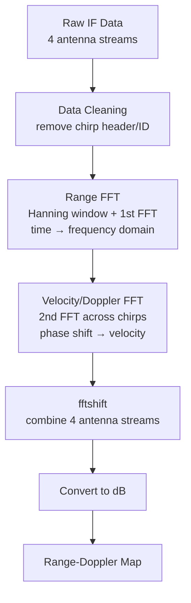
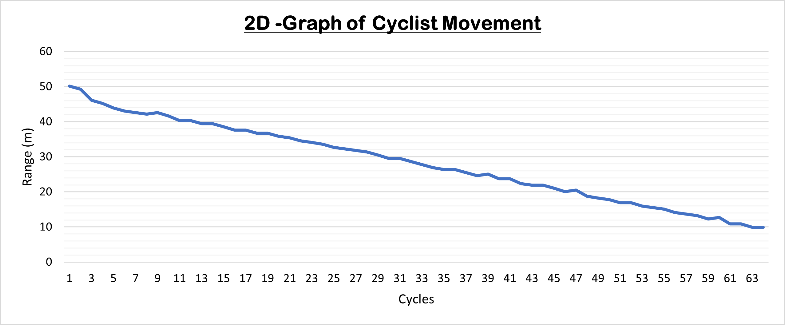

# FMCW Radar Signal Processing – Range & Velocity Detection

A MATLAB pipeline that processes raw 24 GHz FMCW radar data into Range-Doppler Maps, extracting target distance, velocity, and radar cross-section characteristics from real-world lab measurements.

## Overview

This project explores how a Frequency Modulated Continuous Wave (FMCW) radar measures distance and speed of moving targets, from the underlying RF theory through to a full MATLAB signal processing chain that turns raw IF data into interpretable Range-Doppler Maps.

Rather than a pulse radar sending short energy bursts, an FMCW radar transmits a continuously frequency-modulated "chirp." The distance and velocity of a target are recovered by comparing the transmitted chirp against its delayed, reflected echo.

## How It Works

**Measuring range:** The frequency of the chirp increases linearly over time. When it reflects off a target and returns, mixing the transmitted and received signals produces a beat frequency (intermediate frequency, f_IF) that is directly proportional to target distance.

**Measuring velocity:** A rapid sequence of chirps is transmitted. A moving target shifts by a tiny fraction of a wavelength between consecutive chirps, producing a measurable phase shift. Applying an FFT across this phase shift sequence extracts the Doppler frequency — and therefore the target's velocity.

**Radial velocity limitation:** The radar can only directly measure velocity along its line of sight. For targets moving at an angle, the true velocity is recovered via `v_true = v_radial / cos(α)`.

## System Parameters

| Parameter | Value |
|---|---|
| Start frequency | 24 GHz |
| Stop frequency | 24.25 GHz |
| Bandwidth (B) | 250 MHz |
| Sampling frequency | 1 MHz |
| Chirp duration | 190 µs |
| Chirps per cycle | 256 |

**Derived system limits:**
- Range resolution: ΔR = c / 2B ≈ **0.6 m**
- Maximum range: R_max = (f_S · c · t_chirp) / 4B ≈ **57 m**

## Signal Processing Pipeline

1. **Data extraction & cleaning** — raw IF data separated into 4 antenna streams; header/identifier rows stripped.
2. **Range FFT** — a Hanning window smooths signal edges, then an FFT converts time-domain IF data into the frequency domain, revealing range. Only relevant positive range bins are kept.
3. **Velocity/Doppler FFT** — a second FFT across chirps converts phase shifts into velocity; another Hanning window suppresses noise.
4. **Combining RD values** — `fftshift` aligns and merges data from all four antennas into the final Range-Doppler Map, converted to dB for visualization.

## Results

### Target comparison at ~20 m

Five target types were isolated at roughly the same distance to compare returned signal magnitude:

| Target | Distance | Magnitude |
|---|---|---|
| Truck | 20.90 m | -105.9 dBm |
| Tram | 19.20 m | -108.9 dBm |
| Car | 20.50 m | -116.3 dBm |
| Pedestrian | 20.50 m | -116.9 dBm |
| Bicycle | 20.50 m | -117.8 dBm |

At equal distance, path loss cancels out — so the magnitude differences come entirely from **Radar Cross Section (RCS)**, driven by:
- **Material** — metallic surfaces (truck, tram, car) reflect strongly; the human body absorbs/scatters more energy.
- **Size** — larger objects intercept and reflect more of the transmitted wave.
- **Geometry** — flat, broadside panels (a truck's side) reflect straight back to the receiver; complex/rounded shapes (a person) scatter energy in multiple directions.

### Tracking a moving target

A bicycle was tracked continuously over 64 radar cycles. The resulting Range-vs-Cycle plot shows the cyclist closing in from ~50 m to ~10 m in a linear (constant-velocity) trend. Minor step artifacts in the curve reflect the radar beam bouncing off different surface areas of the bicycle/cyclist as it moved — not measurement error.

### sample data included; full dataset available on request.
